# Kubernetes APIServer 缓存架构深度解析

## 整体架构图

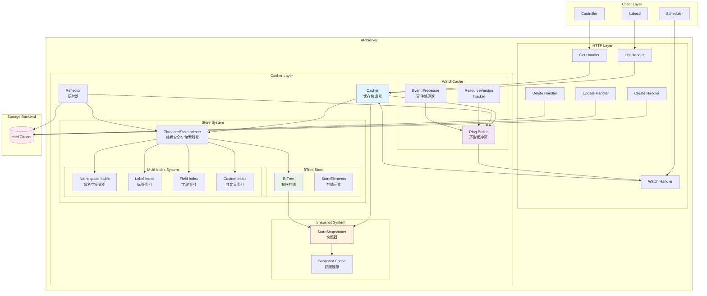

## WatchCache 详细分析
### 设计初衷与核心特性
设计初衷：
1. 减少 etcd 压力 ：避免每个 Watch 请求都直接连接 etcd
2. 支持历史回放 ：允许客户端从任意历史版本开始 Watch
3. 提高并发性能 ：单个 etcd Watch 连接服务多个客户端
4. 保证事件顺序 ：确保事件按照 ResourceVersion 严格有序

### WatchCache 内部结构
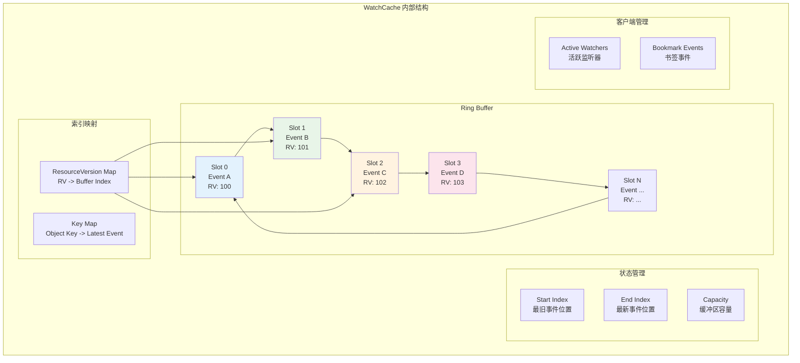

**环形缓冲区工作原理**
```golang
type watchCache struct {
    // 环形缓冲区核心
    cache []watchCacheEvent  // 固定大小的事件数组
    startIndex int           // 最旧事件的索引
    endIndex   int           // 下一个事件的插入位置
    capacity   int           // 缓冲区容量
    
    // 版本索引
    resourceVersions map[uint64]int  // RV -> 缓冲区索引
    
    // 对象索引
    keyToIndex map[string]int        // 对象键 -> 最新事件索引
    
    // 同步控制
    lock sync.RWMutex
    cond *sync.Cond
}

type watchCacheEvent struct {
    Type            watch.EventType   // ADDED, MODIFIED, DELETED
    Object          runtime.Object    // 当前对象状态
    PrevObject      runtime.Object    // 前一个对象状态
    Key             string            // 对象唯一键
    ResourceVersion uint64            // 全局递增版本号
    RecordTime      time.Time         // 事件记录时间
}
```

**动态扩缩容机制**
容量管理策略：
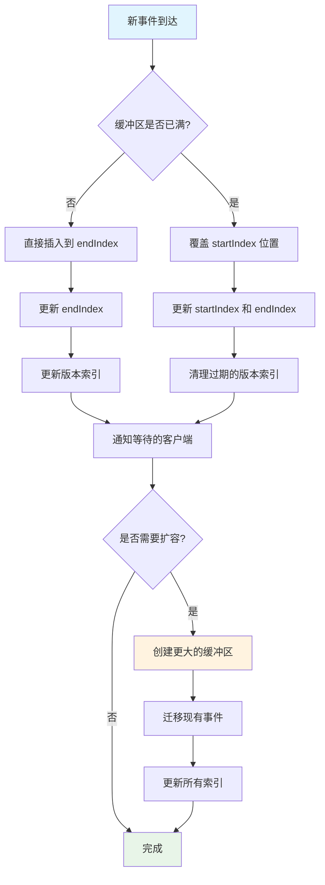
扩容触发条件：
1. 客户端积压 ：当大量客户端请求历史事件时
2. 高频更新 ：资源更新频率超过客户端消费速度
3. 内存压力 ：系统内存使用率达到阈值

### Watch 事件流处理
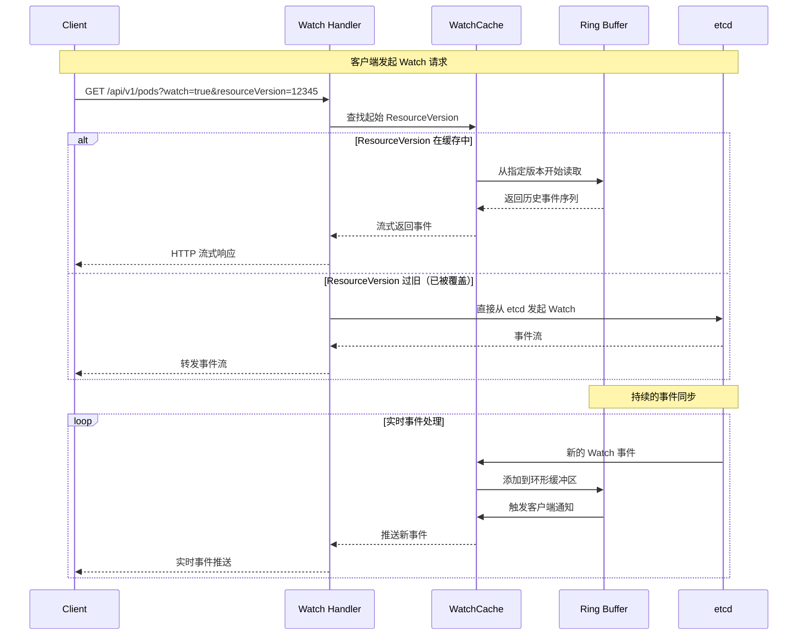

## Snapshot 系统深度解析
1. 一致性保证 ：提供某个时间点的一致性数据视图
2. 并发优化 ：避免长时间持锁影响写操作
3. 分页支持 ：为大规模 List 操作提供稳定的数据基础
4. 性能优化 ：减少重复的数据遍历和过滤操作

**Snapshot 存储结构**
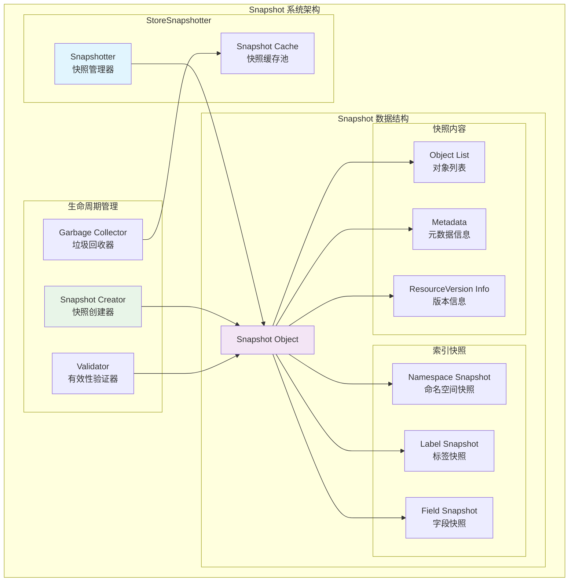

**Snapshot 与 ResourceVersion 的关系**
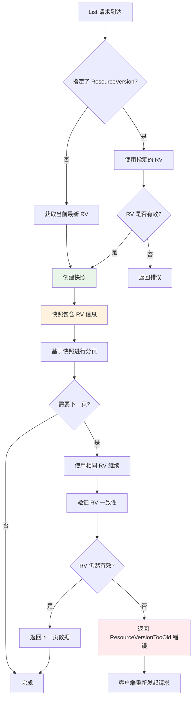

**快照创建与管理机制**
```golang
type storeSnapshotter struct {
    store Store  // 底层存储引用
}

type Snapshot struct {
    // 快照元数据
    ResourceVersion string    // 快照对应的资源版本
    CreatedAt      time.Time // 创建时间
    ExpiresAt      time.Time // 过期时间
    
    // 快照数据
    Objects []runtime.Object  // 对象列表
    
    // 索引快照
    IndexSnapshots map[string]map[string][]string
    
    // 统计信息
    TotalCount int            // 总对象数量
    FilteredCount int         // 过滤后数量
}

// 快照创建过程
func (s *storeSnapshotter) List() []interface{} {
    // 1. 获取读锁（短暂持锁）
    s.store.lock.RLock()
    
    // 2. 快速复制对象引用（而非深拷贝）
    objects := make([]interface{}, 0, s.store.Count())
    s.store.tree.Ascend(func(item *storeElement) bool {
        objects = append(objects, item.Object)
        return true
    })
    
    // 3. 释放锁
    s.store.lock.RUnlock()
    
    return objects
}
```

**快照带来的核心优势**
1. 一致性保证：
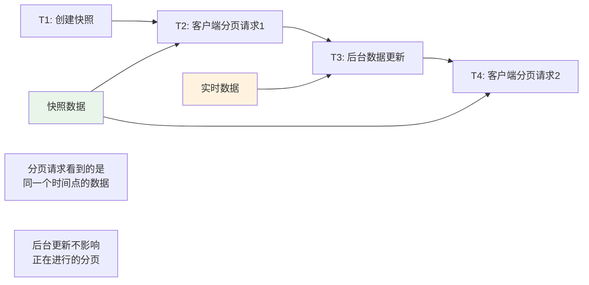

2. 性能优化：
- 减少锁竞争 ：快照创建时短暂持锁，后续访问无需加锁
- 避免重复计算 ：过滤和排序结果可以缓存
- 内存效率 ：使用对象引用而非深拷贝

3. 分页稳定性：
```golang
// 分页请求处理
func (c *Cacher) List(ctx context.Context, key string, opts storage.ListOptions) (*storage.ListResult, error) {
    // 1. 确定 ResourceVersion
    resourceVersion := opts.ResourceVersion
    if resourceVersion == "" {
        resourceVersion = c.getCurrentResourceVersion()
    }
    
    // 2. 创建或获取快照
    snapshot := c.getOrCreateSnapshot(resourceVersion)
    
    // 3. 基于快照进行分页
    startIndex := c.findContinueIndex(snapshot, opts.Continue)
    endIndex := startIndex + opts.Limit
    
    // 4. 返回分页结果
    return &storage.ListResult{
        Objects:         snapshot.Objects[startIndex:endIndex],
        ResourceVersion: resourceVersion,
        Continue:        c.encodeContinueToken(endIndex),
    }, nil
}
```

## BTree Store 深度分析
1. 有序存储 ：支持按键排序的高效存储
2. 范围查询 ：支持前缀查询和范围扫描
3. 高性能 ：O(log n) 的增删改查复杂度
4. 内存效率 ：紧凑的内存布局

**BTree 内部结构**
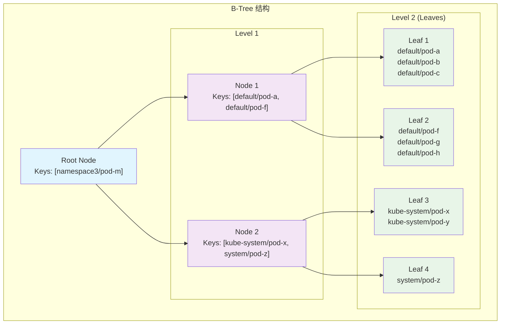

**前缀查询优化**
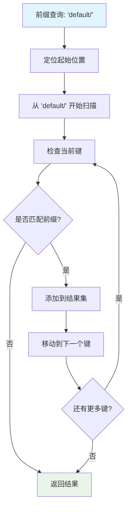

## Multi-Index 系统详解
### 索引系统架构
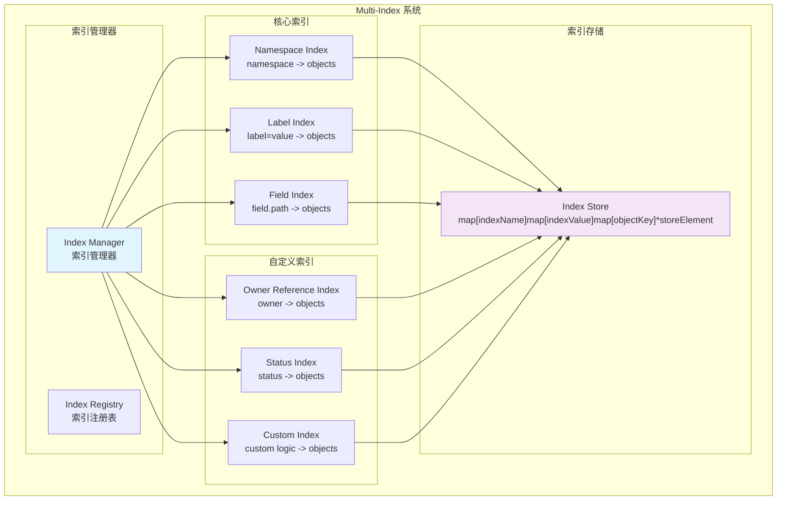

### 索引更新流程
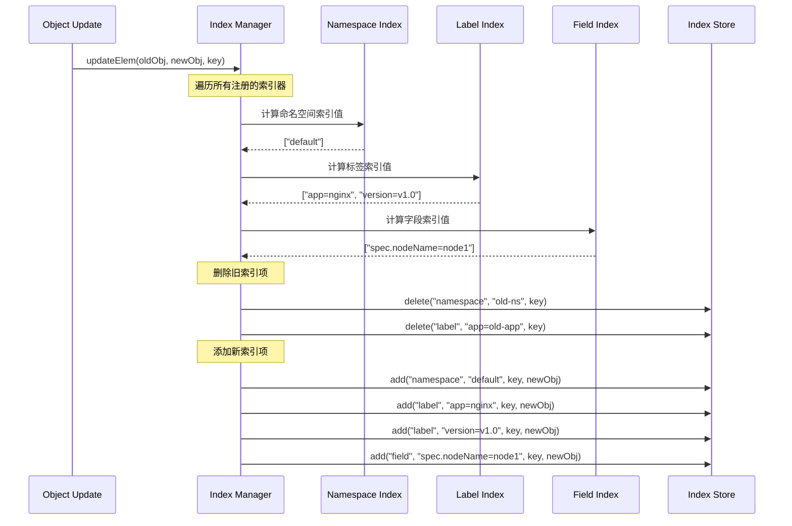

## 性能优化与监控
### 缓存性能指标
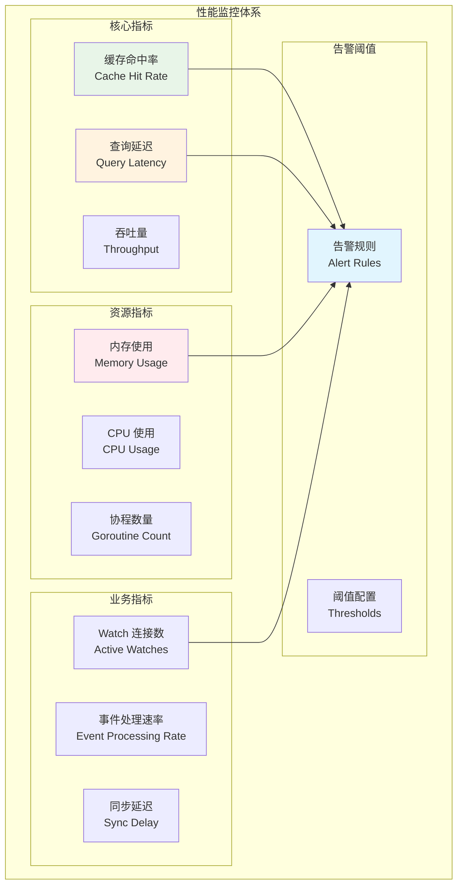

### 自动调优机制
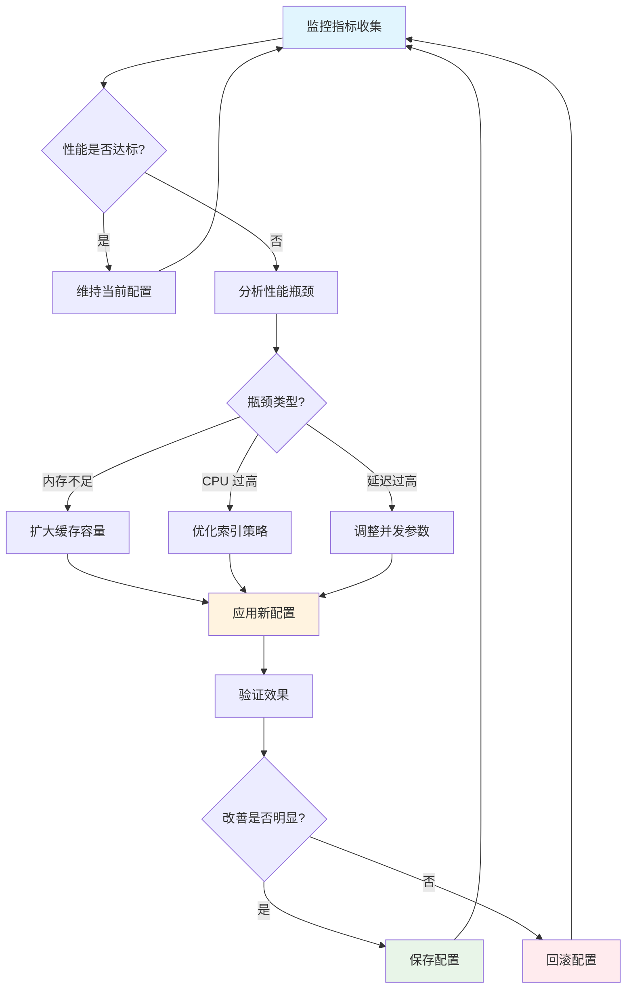

## 总结
Kubernetes APIServer 的缓存架构通过精心设计的多层次系统实现了：
1. WatchCache ：通过环形缓冲区提供高效的事件流服务，支持历史回放和动态扩缩容
2. Snapshot 系统 ：确保分页查询的一致性，优化大规模 List 操作的性能
3. BTree Store ：提供有序存储和高效的范围查询能力
4. Multi-Index 系统 ：支持多维度的快速查询和过滤
5. 性能监控 ：全面的指标体系和自动调优机制

这些组件协同工作，为 Kubernetes 集群提供了高性能、高可用的 API 服务能力。