# Containerd 与 Nydus Snapshotter 工作流分析

## 1. 文档目标

这篇文档基于本地源码，对 `containerd` 与 `nydus-snapshotter` 的交互做一次完整梳理，覆盖：

1. 镜像拉取
2. 容器创建
3. 容器启动
4. 镜像层、`diffID`、`chainID`、快照、容器 rootfs 的关联关系
5. `containerd` 与 `nydus-snapshotter` 各自保存的元数据
6. 原生 OCI、Nydus、estargz/stargz 这几类镜像对应的快照链差异
7. 为什么 Nydus 和“zran 类”镜像能实现加速

分析基于以下源码目录：

- `containerd`: `/Users/xuehaishan/workspace/code/containerd`
- `nydus-snapshotter`: `/Users/xuehaishan/workspace/code/nydus-snapshotter`

说明：

- 本文里提到的“zran 镜像”，从本仓库源码视角，最直接对应的是 `estargz/stargz` 兼容路径。源码里显式实现的是 `stargz` 适配，但它背后的核心思想与“随机访问压缩层索引”是一致的。

## 2. 关键源码入口

### containerd

- 镜像拉取主入口：`pull.go`
- 镜像解包：`image.go`、`rootfs/apply.go`、`pkg/unpack/unpacker.go`
- CRI 拉镜像：`pkg/cri/server/image_pull.go`
- CRI 创建容器：`pkg/cri/server/container_create.go`
- CRI 启动容器：`pkg/cri/server/container_start.go`
- 容器 rootfs 绑定：`container.go`、`container_opts.go`
- 元数据结构：`metadata/buckets.go`

### nydus-snapshotter

- gRPC snapshotter 服务：`cmd/containerd-nydus-grpc/snapshotter.go`
- 快照主逻辑：`snapshot/snapshot.go`
- 镜像类型分流：`snapshot/process.go`
- Nydus 文件系统挂载：`pkg/filesystem/fs.go`
- RAFS 实例：`pkg/rafs/rafs.go`
- estargz/stargz 适配：`pkg/filesystem/stargz_adaptor.go`、`pkg/stargz/resolver.go`
- tarfs 路径：`pkg/filesystem/tarfs_adaptor.go`、`pkg/tarfs/tarfs.go`
- nydus 自有元数据库：`pkg/store/database.go`

## 3. 总体架构

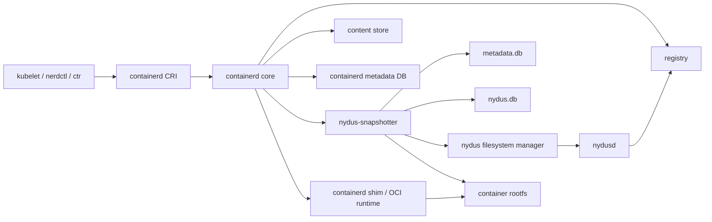

这张图里最核心的分工是：

- `containerd` 负责控制面：
  - 拉镜像
  - 管内容对象
  - 管 image / container / snapshot / lease 元数据
- `snapshotter` 负责数据面：
  - 决定快照如何准备
  - 决定 rootfs 最终以什么 mount 形式交给 runtime

## 4. 先建立几个核心对象概念

如果不先把这些对象分清楚，后面很容易把“镜像层”和“快照层”混在一起。

### 4.1 layer digest

这是 registry 里压缩层 blob 的 digest，也就是 manifest 里的 layer descriptor 指向的对象。

### 4.2 diffID

这是层内容在解压并 apply 后的未压缩 digest。`containerd` 会在 apply 成功后把它记录到 content label：

- `containerd.io/uncompressed`

### 4.3 chainID

`chainID` 不是单层 digest，而是从底到顶所有 `diffID` 累积得到的根文件系统身份标识。

可以把它理解成：

- “到当前层为止，这棵 rootfs 的整体身份”

### 4.4 committed snapshot

镜像每处理完一层，containerd 都可能提交一个只读快照。默认情况下：

- committed snapshot key = `chainID`

### 4.5 active snapshot

容器创建时，containerd 会再创建一个可写快照，通常：

- active snapshot key = `container ID`

它的父快照，就是该镜像 rootfs 对应的最终 `chainID`。

### 4.6 container rootfs

容器启动时，runtime 不会直接拿 image 来启动，而是拿：

- `Snapshotter`
- `SnapshotKey`

然后向 snapshotter 请求 `Mounts(snapshotKey)`，由 snapshotter 返回最终 rootfs 的 mount 列表。

## 5. 对象关系总图

```text
registry layer blob digest
└── diffID (uncompressed digest)
    └── chainID (cumulative rootfs ID)
        └── committed snapshot
            └── key = chainID
                └── active snapshot
                    └── key = container ID
                        └── container metadata
                            ├── image
                            ├── snapshotter
                            ├── snapshotKey
                            └── spec
                                └── snapshotter.Mounts(snapshotKey)
                                    └── runtime rootfs
                                        └── container process
```

最重要的一点是：

- 镜像和容器的关联存在于 container metadata 里
- 运行时真正消费的是 `snapshotKey -> mounts -> rootfs`
- 所以启动容器时，核心对象已经不是 image，而是 snapshot

## 6. 端到端流程

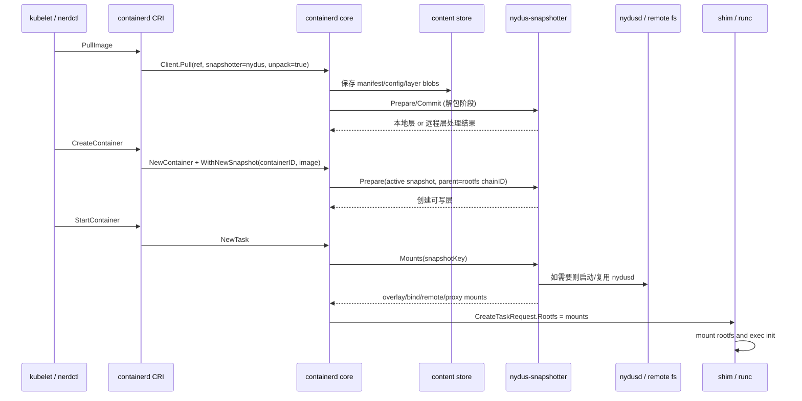

## 7. 阶段一：镜像拉取

### 7.1 CRI 入口

入口在 `containerd/pkg/cri/server/image_pull.go`。

CRI 主要做三件事：

1. 确定这次 pull 使用哪个 snapshotter
2. 组装 `containerd.Client.Pull(...)` 参数
3. pull 成功后创建 image reference，并更新 CRI image store

这里有一个非常关键的配置项：

- `disable_snapshot_annotations = false`

containerd CRI 默认值其实是 `true`，定义在 `containerd/pkg/cri/config/config_unix.go`。而 nydus 示例配置显式改成了 `false`，见 `misc/example/containerd-config.toml`。

这个配置的重要性在于：

- containerd 只有在它为 `false` 时，才会把 image ref、layer digest、manifest digest、image layer 列表等信息作为 annotation 传给 snapshotter
- Nydus、stargz、tarfs 这些远程或转换路径都严重依赖这些标签

### 7.2 containerd Pull

入口在 `containerd/pull.go`。

`Client.Pull()` 的主流程是：

1. 建立 lease，防止中途 GC
2. 如开启 unpack，则构造 unpacker
3. 调用 `fetch()` 拉 descriptor graph
4. 等待 unpack 完成
5. 创建或更新 image record
6. 如 deferred unpack 没做实质工作，再 fallback 到 `Image.Unpack()`

### 7.3 fetch() 到底保存了什么

`fetch()` 会：

1. 解析镜像引用，得到顶层 descriptor
2. 递归拉取 manifest、config、layer blob
3. 把它们都落到 content store
4. 给 content 对象加 GC 引用标签

GC 引用关系来自 `containerd/images/handlers.go` 的 `SetChildrenMappedLabels()`，会写入：

- `containerd.io/gc.ref.content.*`

这意味着：

- manifest 指向 config/layer
- index 指向 manifest
- 父 content 可以通过 label 保住子 content

### 7.4 containerd 是怎么把远程 snapshotter 需要的信息传下去的

在 `containerd/pkg/snapshotters/annotations.go` 里，containerd 会把这些 annotation 挂到 layer descriptor 上：

- `containerd.io/snapshot/cri.image-ref`
- `containerd.io/snapshot/cri.layer-digest`
- `containerd.io/snapshot/cri.image-layers`
- `containerd.io/snapshot/cri.manifest-digest`

之后在 `containerd/pkg/unpack/unpacker.go` 里，这些 annotation 会被继承成 snapshot label，并额外补上：

- `containerd.io/snapshot.ref=<chainID>`

这一步非常关键，因为后面的 nydus-snapshotter 就是靠这些 label 来判断：

- 当前层是哪一个镜像的
- 当前 blob 的 digest 是什么
- 这是哪个 manifest
- 这个层属于哪条 rootfs chain

### 7.5 普通 OCI 解包时，快照是怎么生成的

普通层 apply 的逻辑在：

- `containerd/rootfs/apply.go`
- `containerd/image.go`

每一层的处理都是：

1. 用当前累计 `diffID` 计算新的 `chainID`
2. `Prepare(tempKey, parentChainID)`
3. 把本层 tar diff apply 到 snapshotter 返回的 mounts 上
4. 校验 apply 后得到的 `diffID`
5. `Commit(chainID, tempKey)`

于是，一个镜像 3 层的快照链，大致是这样：

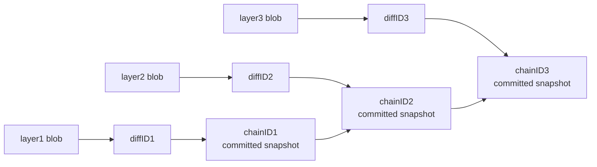

其中：

- `chainID1 = ChainID(diffID1)`
- `chainID2 = ChainID(diffID1, diffID2)`
- `chainID3 = ChainID(diffID1, diffID2, diffID3)`

所以 committed snapshot 不是“一层一个 blob 的简单映射”，而是“一层层累计后的 rootfs 状态”。

### 7.6 pull 阶段 containerd 保存哪些元数据

containerd 的元数据 bucket 结构定义在 `containerd/metadata/buckets.go`。

本流程里最关键的对象有：

- `images`
- `containers`
- `snapshots`
- `content`
- `leases`

拉镜像阶段主要会保存：

- content blobs
  - manifest
  - config
  - compressed layer blob
- content labels
  - `containerd.io/gc.ref.content.*`
  - `containerd.io/uncompressed`
  - `containerd.io/gc.ref.snapshot.<snapshotter>`
- image record
  - image name
  - target descriptor
  - labels
- snapshot metadata
  - snapshot key
  - parent
  - labels
- lease record
  - 对 content / snapshot / ingest 的引用

## 8. 阶段二：容器创建

### 8.1 CreateContainer 入口

入口在 `containerd/pkg/cri/server/container_create.go`。

CRI 创建容器时，最重要的两个动作是：

1. 生成 container metadata 和 OCI spec
2. 调 `WithNewSnapshot(containerID, image, ...)` 为容器准备可写层

### 8.2 WithNewSnapshot：容器可写层怎么来的

真正逻辑在：

- `containerd/container_opts.go`
- `containerd/pkg/cri/opts/container.go`

流程是：

1. 从 image config 取出整张镜像的 `RootFS diffIDs`
2. 算出最终 rootfs `chainID`
3. 用它作为 parent snapshot key
4. 调 `snapshotter.Prepare(containerID, parentChainID)`
5. 把 `Snapshotter`、`SnapshotKey`、`Image` 存到 container metadata

如果 parent snapshot 不存在，CRI 包装层会先触发 `i.Unpack()` 再重试。

### 8.3 一个运行容器与镜像、快照的关系

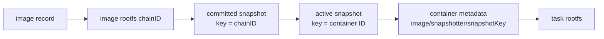

这里最容易混淆的一点是：

- image record 不直接指向 task rootfs
- task rootfs 是通过 `container metadata -> snapshotKey -> snapshotter.Mounts()` 建出来的

### 8.4 create 阶段 containerd 保存哪些元数据

container record 里会保存：

- `ID`
- `Labels`
- `Image`
- `Runtime`
- `Spec`
- `SnapshotKey`
- `Snapshotter`
- `Extensions`

CRI 还会额外保存自己的容器元数据，例如：

- container name
- sandbox ID
- CRI container config
- image ref
- log path
- stop signal
- process label

## 9. 阶段三：容器启动

### 9.1 StartContainer 到 NewTask

入口在：

- `containerd/pkg/cri/server/container_start.go`
- `containerd/container.go`

`container.NewTask()` 的核心逻辑是：

1. 读取 container metadata
2. 找到 `Snapshotter` 和 `SnapshotKey`
3. 调 `snapshotter.Mounts(snapshotKey)`
4. 把 mount 列表塞进 `CreateTaskRequest.Rootfs`
5. 交给 shim / runtime 创建 task

也就是说：

- runtime 不关心镜像格式
- runtime 只关心 snapshotter 最终返回的 mounts

### 9.2 Nydus snapshotter 返回的几类 rootfs

这些逻辑在 `snapshot/snapshot.go`：

- `mountNative()`
- `mountRemote()`
- `mountProxy()`

它们对应三类 rootfs：

1. 原生 bind / overlay
2. 远程 overlay
   - lowerdir 里包含 Nydus mountpoint
3. 代理型 `fuse.nydus-overlayfs`

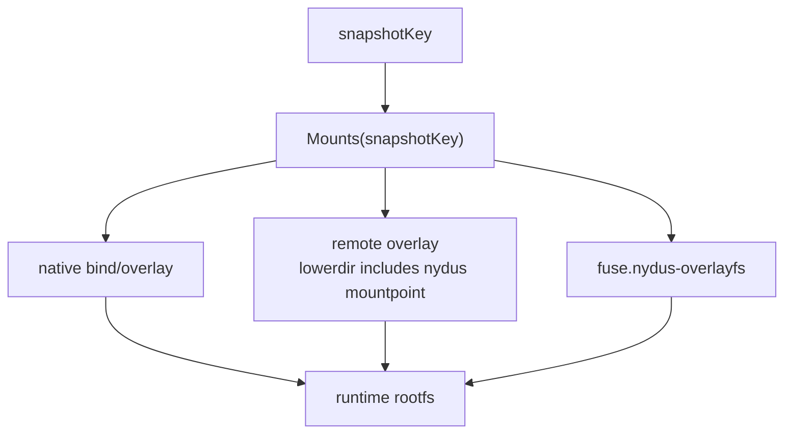

## 10. nydus-snapshotter 的分流逻辑

核心分流在 `snapshot/process.go`，它会区分两大类场景：

1. pull 阶段创建只读层快照
2. create 阶段创建容器可写快照

### 10.1 pull 阶段的只读层

对于 pull 阶段的只读层，主要分支是：

1. proxy 模式
2. Nydus meta layer
3. Nydus data layer
4. index alternative
5. referrer alternative
6. estargz/stargz
7. tarfs
8. fallback 到原生 OCI unpack

对应处理语义可以压缩成三种：

- `defaultHandler`
  - 让 containerd 正常下载并解包
- `skipHandler`
  - 不让 containerd 完整 unpack，但仍提交 committed snapshot
- `remoteHandler`
  - 直接准备可远程挂载的 rootfs

其中最关键的一点是：

- `skipHandler` 并不等于“不建快照”
- 它的真实含义是“跳过传统 layer apply，但仍然把这层作为一个 committed snapshot 提交到快照链中”

所以对 Nydus / stargz / tarfs 来说：

- snapshot chain 仍然存在
- 只是快照背后的数据形态不再是“完整展开的 overlay lowerdir”

### 10.2 create 阶段的可写层

容器可写层创建时，nydus 会继续判断它的 parent chain：

1. 如果 parent 暗示 proxy，则走 proxy
2. 如果 parent 链里能找到 Nydus meta layer，则走 remote mount
3. 如果能找到 index/referrer alternative，则拉 metadata 后 remote mount
4. 如果 parent 链是 stargz，则 merge metadata 后 remote mount
5. 如果 parent 链是 tarfs，则 merge tarfs metadata 后 remote mount
6. 否则 fallback 到 native overlay

## 11. 不同镜像类型的快照链结构

这一节是本文最重要的补充。

### 11.1 原生 OCI 镜像的快照链

原生 OCI 下，每一层都走传统 apply：

- 下载完整 blob
- 解压
- apply 到 snapshot mounts
- commit 成 `chainID`

所以它的 committed snapshot 里，通常都有真实展开后的目录树。

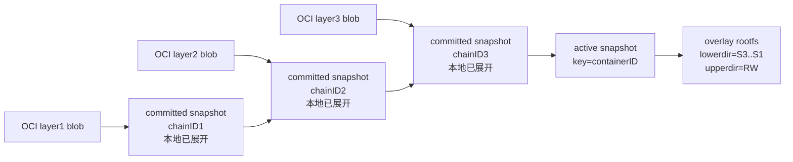

特点：

- 快照链完全对应本地展开的 overlay lowerdir
- 启动前成本高
- 运行时读文件基本不依赖远端 blob

### 11.2 原生 Nydus 镜像的快照链

原生 Nydus 镜像通常由：

- Nydus data layer
- Nydus meta layer 或 bootstrap layer

组成。

在 nydus-snapshotter 里：

- data layer 往往走 `skipHandler`
- meta layer 走 `defaultHandler`

所以它的快照链更像是：

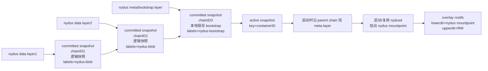

特点：

- committed snapshot 链仍然完整存在
- 但 data layer 对应的快照很多只是“逻辑锚点 + labels”，并不是完整展开目录树
- 真正的数据读取在运行时由 bootstrap + nydusd 去驱动

换句话说：

- 对 containerd 来说，它看到的仍然是一条标准 snapshot chain
- 对文件系统来说，这条链背后不再是传统 overlay lowerdir，而是“bootstrap + 懒加载数据块”

### 11.3 estargz/stargz，也就是这里对应的“zran 类”路径

源码显式实现的是 `stargz` 适配：

- 读取 footer
- 解析 TOC offset
- 用 HTTP range 只拉 TOC
- 转换成 Nydus bootstrap / `blob.meta`

所以它的快照链大致是：

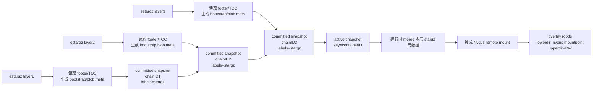

特点：

- 这条快照链也不是传统“完整 unpack 后的本地目录树”
- 每层保存的是索引提取和转换后的 metadata
- 真正文件内容仍来自远端原始 blob

如果用一句话概括它和原生 Nydus 的差异：

- 原生 Nydus：镜像本身就已经是 Nydus 语义
- estargz/stargz：镜像原始格式仍是 OCI gzip 层，但 snapshotter 在 pull 时把它改造成可被 Nydus 懒加载的 metadata 视图

### 11.3.1 estargz 的 footer 和 TOC 到底是什么

这一点可以直接从 `stargz-snapshotter/estargz` 的实现看出来。

#### footer 是什么

`footer` 是 layer blob 末尾的一小段固定格式数据。对于 gzip-based eStargz，footer 大小是 51 字节，定义在：

- `github.com/containerd/stargz-snapshotter/estargz/types.go`

它本质上是一个“空 gzip stream”，但它的 `gzip Extra` 字段里编码了：

- TOC 在 blob 中的偏移
- `STARGZ` 魔数

也就是说，footer 不是文件系统目录树，也不是文件内容，它只是一个“定位器”。

更准确地说：

- footer 自己并不描述文件系统
- footer 只负责告诉读取方“TOC 在哪”
- 真正描述文件系统的是 TOC

所以如果只有 footer，没有 TOC，是不能构造文件系统的。

#### TOC 是什么

TOC 是 `Table Of Contents`，在 eStargz 里被存成一个 JSON 文件：

- 文件名固定是 `stargz.index.json`

这个 JSON 文件并不是独立对象，而是被打包成 blob 末尾的一个 tar entry，再被 gzip 包起来。实现见：

- `github.com/containerd/stargz-snapshotter/estargz/gzip.go`

TOC 里保存的是文件系统元数据和数据定位信息，例如：

- 路径名
- 文件类型
- 权限
- uid/gid
- symlink/hardlink
- 文件大小
- 文件内容在 blob 中的 offset
- chunkOffset
- chunkSize
- chunkDigest

也就是说，TOC 本质上回答的是：

- “根文件系统里有哪些文件和目录”
- “每个文件的数据在这个压缩层 blob 里的什么位置”

再说得更底层一点，TOC 同时携带了两类信息：

1. 命名空间信息
   - 目录树
   - 文件名
   - inode 语义对应的属性
   - 权限、uid/gid、link、xattr 等
2. 数据寻址信息
   - 文件数据在哪个 blob 的哪个 offset
   - 大文件如何拆成多个 chunk
   - 每个 chunk 的大小与 digest

所以：

- footer 解决“去哪里找 TOC”
- TOC 解决“文件系统长什么样、数据去哪里取”

#### estargz layer blob 的内部组织

可以把一个 estargz layer blob 粗略理解成：

```text
estargz layer blob
├── 普通文件数据块
│   └── 按 gzip stream / chunk 组织
├── TOC gzip stream
│   └── tar entry: stargz.index.json
└── Footer
    └── 记录 TOC offset + STARGZ magic
```

再细一点看：

```text
单个 estargz layer blob 内部结构
├── 文件内容 chunk 1
├── 文件内容 chunk 2
├── 文件内容 chunk 3
├── 末尾 TOC gzip stream
│   └── tar entry = stargz.index.json
└── 最后 51 字节 footer
    └── gzip Extra 中写入 TOC offset
```

#### 是不是每一层都有 footer 和 TOC

如果一层本身就是 estargz 格式，那么：

- 这一层自己的 blob 末尾就会有 footer
- 这一层自己的 blob 里就会有对应的 TOC

所以答案是：

- 不是“普通 OCI 的每一层都有”
- 而是“每一个 estargz layer 都应该各自有自己的 footer 和 TOC”

这也是为什么 snapshotter 会逐层判断：

- 当前 layer blob 能不能从 footer 里解析出 TOC offset

如果能，就把这一层视为 stargz layer；如果不能，就不是这条路径。

#### 为什么 TOC 可以转换成 bootstrap/blob.meta

原因不是“它们长得像”，而是“它们表达的是同一类信息，只是编码格式不同”。

TOC 表达的是：

- 文件系统目录树
- 文件属性
- 文件内容到 blob/chunk 的映射

而 Nydus 运行时真正需要的是它自己的两类元数据：

- `bootstrap`
- `blob.meta`

可以这样理解它们的职责分工：

- `bootstrap`
  - Nydus 文件系统的主元数据
  - 描述目录树、inode、文件属性、文件与数据块的逻辑映射
- `blob.meta`
  - 面向具体 blob 的辅助元数据
  - 描述 blob/chunk 级别的信息，方便运行时定位、校验、缓存

所以从 TOC 转换成 `bootstrap/blob.meta`，本质上是：

- 把 estargz 的“文件系统索引格式”
- 翻译成 Nydus 的“文件系统索引格式”

这一步不需要先拿完整文件内容，是因为：

- TOC 里已经有足够多的元数据来描述“文件系统骨架”和“数据位置”
- 转换只是把索引结构从一种 schema 映射到另一种 schema

#### 为什么 bootstrap/blob.meta 可以构造出文件系统

这里的“构造文件系统”，不是指：

- 先把所有文件完整下载到本地目录树

而是指：

- 先把一个可以被挂载和遍历的文件系统视图建立起来

构造一个可挂载 rootfs，最少需要两类能力：

- 目录树
- inode 和属性
- 文件数据在 blob 中的定位关系

`bootstrap` 解决前两项，`blob.meta` 和其中的 blob/chunk 信息帮助解决第三项。

于是运行时可以做到：

1. 先把目录树、文件属性、层叠关系挂出来
2. 进程执行 `open/readdir/stat` 时，先靠 bootstrap 回答
3. 进程执行 `read` 时，再根据 bootstrap/blob.meta 中的定位信息去拉远端真实数据

所以更准确的表述是：

- `bootstrap/blob.meta` 能构造出“可挂载、可遍历、可按需读”的文件系统
- 但它们本身不是完整文件内容
- 真正的数据内容仍然在远端原始 blob 中

可以把这条链压缩成一句话：

```text
footer -> 告诉我 TOC 在哪
TOC -> 告诉我文件系统长什么样、数据在哪
bootstrap/blob.meta -> 把这份信息翻译成 Nydus 运行时可直接挂载和按需读取的格式
```

### 11.3.2 三类镜像在镜像结构上的差异

如果换一个角度，不看 snapshot chain，而是直接看“镜像本身长什么样”，三类格式差异会更清楚。

#### 普通 OCI 镜像结构

```text
OCI image
├── manifest
│   ├── top layer blob
│   │   └── gzip-compressed tar stream
│   ├── middle layer blob
│   │   └── gzip-compressed tar stream
│   └── base layer blob
│       └── gzip-compressed tar stream
└── config
```

特点：

- 每层通常是普通 tar.gz 或 gzip 压缩层
- 没有专门的随机访问 TOC/footer 语义
- 想要 rootfs，通常只能完整下载、解压、apply

#### 原生 Nydus 镜像结构

```text
Nydus image
├── manifest
│   ├── meta/bootstrap layer
│   │   ├── label: nydus-bootstrap
│   │   └── bootstrap / RAFS metadata
│   ├── data blob layer 3
│   │   ├── label: nydus-blob
│   │   └── blob data chunks
│   ├── data blob layer 2
│   │   ├── label: nydus-blob
│   │   └── blob data chunks
│   └── data blob layer 1
│       ├── label: nydus-blob
│       └── blob data chunks
└── config
```

特点：

- 镜像本身就已经被构造成 Nydus 语义
- meta layer 提供文件系统元数据入口
- data layer 提供真实数据块
- 运行时直接由 bootstrap 指向数据 blob

#### estargz/stargz（zran 类）镜像结构

```text
estargz image
├── manifest
│   ├── top estargz layer
│   │   └── file chunks
│   │       └── TOC gzip stream
│   │           └── footer
│   ├── middle estargz layer
│   │   └── file chunks
│   │       └── TOC gzip stream
│   │           └── footer
│   └── base estargz layer
│       └── file chunks
│           └── TOC gzip stream
│               └── footer
└── config
```

特点：

- 镜像原始格式仍是 OCI layer blob
- 但每层 blob 内部已经额外携带了 TOC 和 footer
- 因此 snapshotter 能在不完整下载整层的前提下，先抽出元数据，再转成 Nydus 可挂载视图

#### 三种镜像结构放在一起看

```text
普通 OCI
image
├── manifest
│   └── layers
│       └── gzip tar data
└── config

原生 Nydus
image
├── manifest
│   ├── bootstrap/meta layer
│   └── data blob layers
└── config

estargz / stargz
image
├── manifest
│   └── estargz layers
│       └── file chunks + TOC + footer
└── config
```

### 11.4 三种快照链对比

如果只是画“链式结构”，更容易看到控制面里的父子关系，但不容易看清三种格式在真实运行时的差异。

这里改成从时序角度对比三种格式的工作流：

1. pull 阶段下载了什么
2. snapshotter 如何准备 committed snapshot
3. create 阶段如何创建容器可写层
4. start 阶段如何构造 rootfs
5. 首次读文件时数据从哪里来

#### 11.4.1 原生 OCI 工作时序

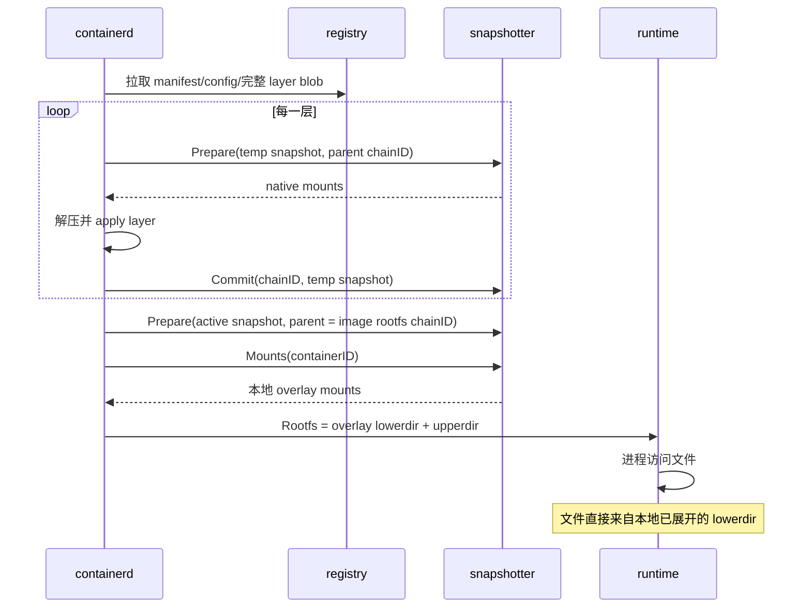

#### 11.4.2 原生 Nydus 工作时序

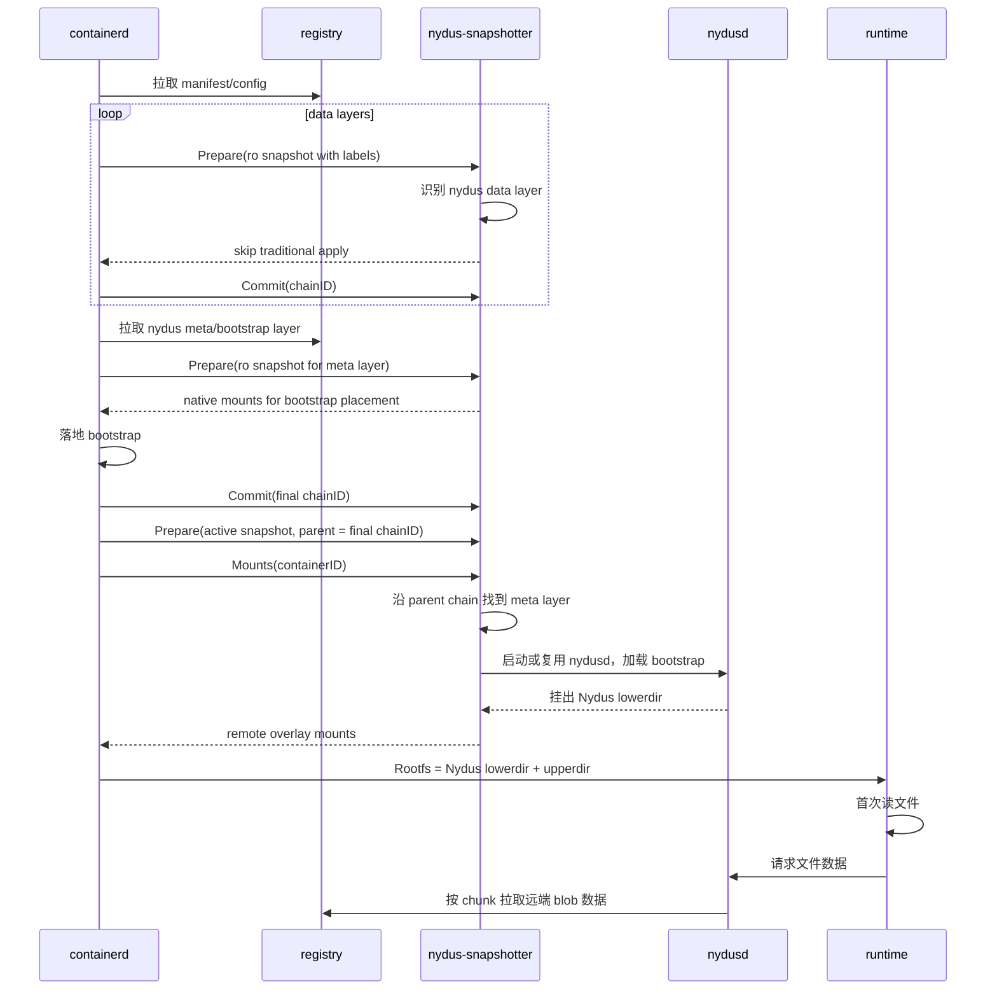

#### 11.4.3 estargz/stargz（zran 类）工作时序

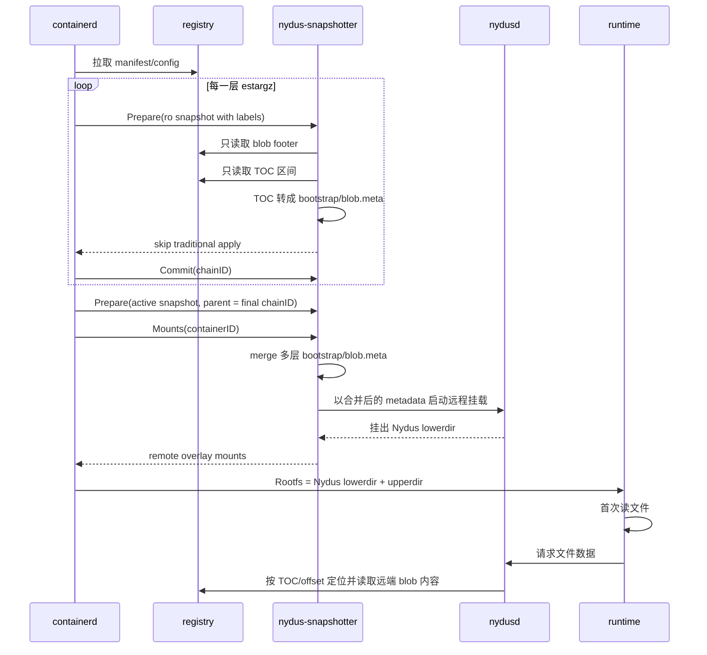

上面三条时序图比“结构图”更适合表达真实差异。接下来如果要更准确地比较三类镜像，还需要同时从三条轴线看：

1. pull 阶段到底下载了什么
2. committed snapshot 背后实际保存了什么
3. 运行时 rootfs 是怎么构出来的

| 类型 | pull 阶段实际下载的数据 | committed snapshot 背后主要保存什么 | 运行时 rootfs 如何构造 | 是否在 pull 阶段完整 apply 层内容 |
| --- | --- | --- | --- | --- |
| 原生 OCI | 完整 layer blob，随后完整解压和 apply | 本地展开后的目录树，对应 overlay lowerdir | 直接用本地 lowerdir 叠 active snapshot upperdir | 是 |
| 原生 Nydus | 主要是 bootstrap/meta layer；data blob 不做传统全量 unpack | 快照链仍存在，但 data layer 更多是逻辑快照和标签，meta layer 保存 bootstrap | 先找到 meta layer，启动或复用 nydusd，把 Nydus mountpoint 作为 lowerdir，再叠 active snapshot upperdir | 否 |
| estargz/stargz | 不拉完整层数据，只拉 footer、TOC，以及转换时生成的 bootstrap/blob.meta | 快照链仍存在，但每层主要对应转换后的 metadata，而不是完整展开目录树 | 运行时 merge 多层 bootstrap/blob.meta，交给 Nydus 形成远程 lowerdir，再叠 active snapshot upperdir | 否 |

换句话说：

- 原生 OCI 的 committed snapshot 更接近“已经物化好的文件系统层”
- 原生 Nydus 的 committed snapshot 更接近“指向远端数据 blob 的文件系统元数据层”
- estargz/stargz 的 committed snapshot 更接近“由压缩层索引转换出来的文件系统元数据层”

因此，前一版如果只写“快照链对比”，容易让人误以为三者只是在 label 上不同；更准确的说法应该是：

- 三者在 containerd 控制面里都表现为一条 snapshot chain
- 但这条 chain 背后的数据形态和 rootfs 构造方式是完全不同的

## 12. 为什么会加速

### 12.1 原生 OCI 的成本

原生 OCI 在启动前要做很多重活：

1. 拉完整层 blob
2. 全量解压
3. 全量 apply
4. 在本地构造 overlay lowerdir

这部分成本就在 `containerd/rootfs/apply.go`。

### 12.2 原生 Nydus 的加速原理

Nydus 的关键变化是：

1. 先准备 bootstrap
2. 只把 rootfs 元数据准备好
3. 数据块按需拉取
4. chunk cache 可复用
5. nydusd 可共享

于是启动路径从：

- “先完整展开 rootfs，再运行”

变成：

- “先把 rootfs 元数据挂出来，边运行边取数据”

### 12.3 estargz/stargz 的加速原理

这条路径快在：

1. 不需要先把 gzip 层完整下载和解压
2. 先读 footer / TOC
3. 只拿 metadata
4. 运行时再按需读取真实 blob 内容

### 12.4 tarfs 的加速原理

tarfs 也属于“跳过传统完整 untar lowerdir”的一类优化：

1. 先把 OCI layer 转成 tarfs metadata
2. 必要时导出 block device / verity 信息
3. 运行时直接挂 EROFS 风格的结果

## 13. containerd 保存的元数据

containerd 的元数据结构定义在 `containerd/metadata/buckets.go`。

本流程里最重要的几类对象是：

### 13.1 images

保存：

- image name
- target descriptor
- labels
- 时间戳

### 13.2 containers

保存：

- spec
- image
- snapshotter
- snapshotKey
- runtime
- labels
- extensions

### 13.3 snapshots

保存：

- snapshotter 名称
- snapshot key
- backend name
- parent
- children
- labels

另外，containerd 的 metadata snapshot service 会把逻辑 key 映射到 backend key，backend key 形如：

- `namespace/seq/key`

### 13.4 content

保存：

- blob digest
- size
- labels

关键 labels 包括：

- `containerd.io/gc.ref.content.*`
- `containerd.io/uncompressed`
- `containerd.io/gc.ref.snapshot.<snapshotter>`

### 13.5 leases

保存：

- snapshot refs
- content refs
- ingest refs

这决定了 pull / unpack 期间哪些对象不能被 GC。

## 14. nydus-snapshotter 保存的元数据

### 14.1 根目录

默认根目录在 `internal/constant/values.go` 里定义为：

- `/var/lib/containerd/io.containerd.snapshotter.v1.nydus`

### 14.2 metadata.db

在 `snapshot/snapshot.go` 中通过 `storage.NewMetaStore(...)` 创建。

它保存的是 snapshotter 自己的快照图信息，例如：

- snapshot kind
- parentage
- labels
- usage
- 本地 snapshot graph

这是一套独立于 containerd metadata DB 的快照元数据库。

### 14.3 nydus.db

在 `pkg/store/database.go` 中创建。

bucket 结构非常简单：

- `v1/daemons`
- `v1/instances`

它主要保存：

- daemon 状态
- RAFS 实例状态

### 14.4 RAFS 实例会记录什么

`pkg/rafs/rafs.go` 里的 `Rafs` 会持久化：

- `ImageID`
- `DaemonID`
- `FsDriver`
- `SnapshotID`
- `SnapshotDir`
- `UnderlyingFiles`
- `Mountpoint`
- `Annotations`

bootstrap 常见位置是：

- `snapshots/<snapshotID>/fs/image/image.boot`

### 14.5 daemon 状态会记录什么

`pkg/daemon/daemon.go` 里的 `ConfigState` 会记录：

- daemon ID
- PID
- API socket
- daemon mode
- fs driver
- mountpoint
- config 目录
- 日志和线程等运行配置

## 15. 从“镜像”到“运行中容器”的最终绑定关系

最后把关系再收成一张图：

```mermaid
flowchart LR
    REF["image reference"]
    IMG["image record"]
    CFG["image config"]
    CHAIN["rootfs chainID"]
    RO["committed snapshot"]
    RW["active snapshot = container ID"]
    CTR["container metadata"]
    M["snapshotter.Mounts(snapshotKey)"]
    ROOT["task rootfs"]
    RUN["running container"]

    REF --> IMG
    IMG --> CFG
    CFG --> CHAIN
    CHAIN --> RO
    RO --> RW
    RW --> CTR
    CTR --> M
    M --> ROOT
    ROOT --> RUN
```

这里最值得记住的一句话是：

- `containerd` 通过 `chainID` 把镜像 rootfs 绑定到只读快照链
- 通过 `container ID` 再把这个 rootfs 绑定到容器可写层
- 运行时并不是直接“挂镜像”，而是“挂这个容器对应的 snapshotKey 所解析出的 rootfs mounts”

## 16. 总结

从源码看，`containerd` 和 `nydus-snapshotter` 的交互模型可以概括为：

1. `containerd` 负责对象管理：
   - image
   - content
   - lease
   - snapshot metadata
   - container metadata
2. `containerd` 用 `diffID -> chainID` 把镜像层转换成 rootfs 身份。
3. `snapshotter` 负责把这个 rootfs 身份变成真实的 mount 结果。
4. 对原生 OCI 来说，快照链背后主要是本地展开后的 overlay lowerdir。
5. 对原生 Nydus 来说，快照链仍然存在，但很多层是“逻辑层 + metadata”，真正数据访问在运行时由 bootstrap + nydusd 完成。
6. 对 estargz/stargz 这类“zran 类”镜像来说，快照链背后保存的是从压缩层索引提取出来的 metadata，再通过 Nydus 方式远程挂载。
7. 所谓加速，本质上都是把“启动前全量下载+解压+展开”的工作，改成“先准备元数据，数据按需读取”。
